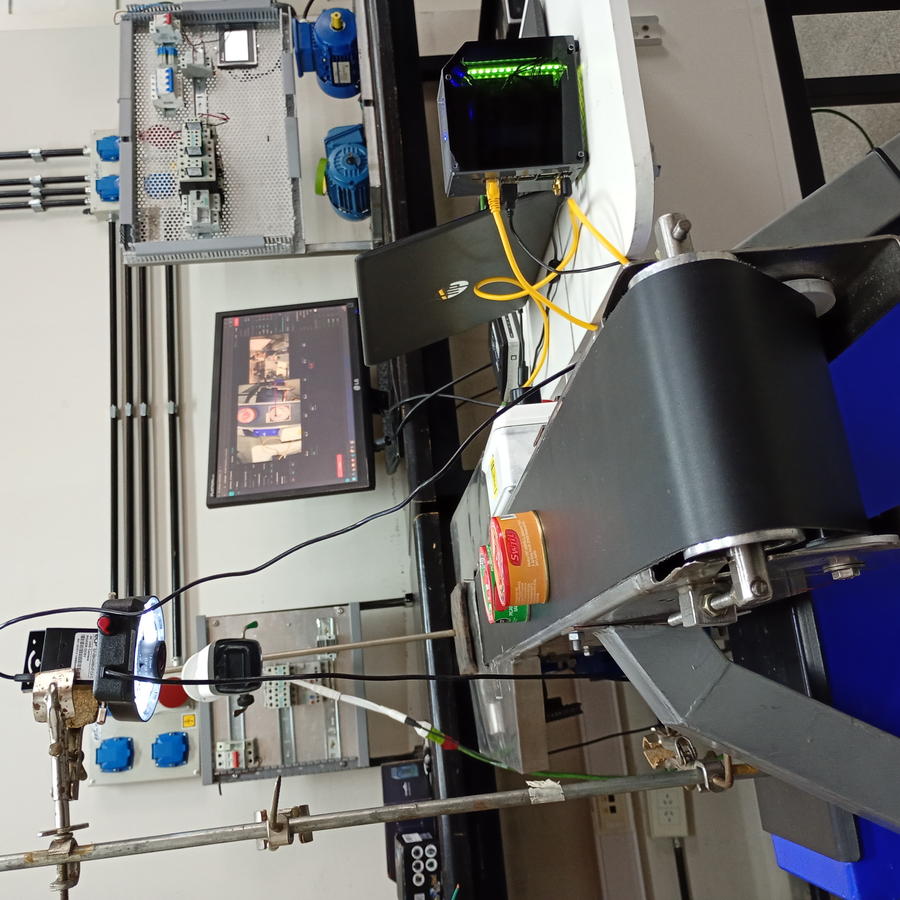
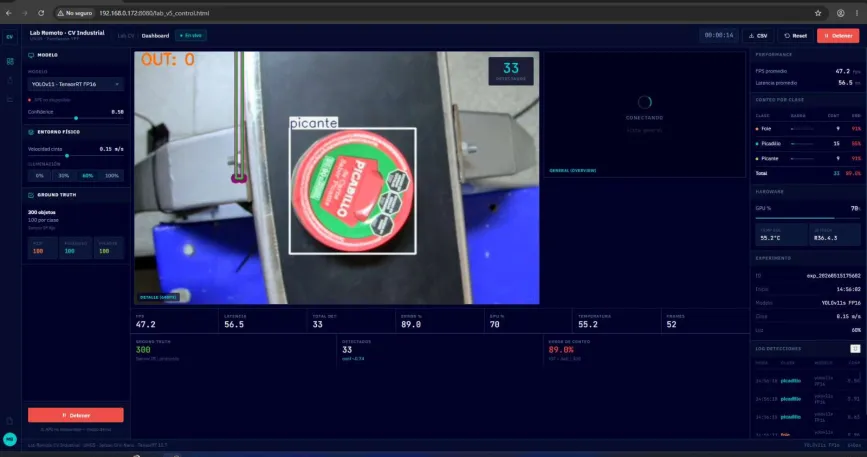

# Remote Vision Lab

> Edge AI laboratory for real-time object detection, classification and tracking on industrial scenarios. Built around NVIDIA Jetson Orin Nano with TensorRT-optimized YOLO models, designed for remote access by students and researchers.



*Industrial camera over a conveyor belt detecting canned food products in real time. Detections, tracking, and live telemetry are accessible via a web dashboard.*

**Status:** 🚧 Under active development — full benchmark in progress.

🇪🇸 [Leer en español](README.es.md)

---

## Live Dashboard



*Real-time inference with **YOLOv11s + TensorRT FP16** on Jetson Orin Nano. Live metrics: FPS, latency, GPU usage, per-class counting, and physical environment variables.*

---

## Overview

`remote-vision-lab` is a low-cost, replicable Edge AI laboratory that runs real-time Computer Vision experiments accessible over the web. The system was designed to let students and researchers train, evaluate and stress-test object detection models on real industrial conditions — including controlled visual disturbances and live electrical telemetry.

The full hardware bill of materials is approximately **USD 500**, making the lab affordable for universities, technical schools and SMEs that cannot justify industrial vision systems in the USD 10,000+ range.

**Funded by Fundación YPF.** Developed at the Engineering Laboratory of **Universidad Nacional de General Sarmiento (UNGS)**, in the framework of **CONFEDI R-Lab** (Argentine Collaborative Network of Remote Access Laboratories).

---

## Key Features

- **Real-time object detection and tracking** with comparative benchmarking between YOLOv8 and YOLOv11.
- **Edge deployment** on NVIDIA Jetson Orin Nano 8GB (67 TOPS), with TensorRT FP16 optimization.
- **Remote access** for students through a web interface (WebRTC video stream + WebSocket commands).
- **Distributed hardware control** via ESP32 over WiFi/WebSocket (motors, sensors, lighting, occlusion servo).
- **Electrical telemetry** from a UPS-protected system, enabling correlation studies between line quality and model performance.
- **Replicable and open** — full hardware and software stack documented for adoption by other institutions.

---

## System Architecture

The system follows a two-layer architecture: the **Jetson Orin Nano** centralizes Computer Vision, backend and frontend services, while an **ESP32** handles real-time hardware control. A **UPS Lyonn CTB-1200AP** provides power resilience and electrical telemetry.

```
[Student Browser] ──WebRTC/WebSocket──> [Jetson Orin Nano]
                                              │
                                              ├── YOLO + TensorRT (inference + tracking + metrics)
                                              ├── MediaMTX (WebRTC streaming)
                                              ├── FastAPI + WebSocket (backend)
                                              ├── Web interface (frontend)
                                              └── NUT (UPS telemetry over USB)
                                              │
                                  WiFi/WebSocket │
                                              ↓
                                          [ESP32]
                                              │
       ┌──────────────────┬───────────────────┼──────────────────┐
       │                  │                   │                  │
   I2C sensors       GPIO/IR barrier      PWM servo        0-10V drive
   (lux, temp,       + encoder           + LEDs            (motor speed)
    humidity)
```

See [`docs/architecture.pdf`](docs/architecture.pdf) for the full architectural document.

---

## Hardware

| Component | Role | Approx. cost (USD) |
|---|---|---|
| Yahboom Jetson Orin Nano Super 8GB | Edge inference + backend + frontend | 250 |
| ESP32 DevKit | Real-time hardware control | 10 |
| UPS Lyonn CTB-1200AP (1200 VA) | Power backup + electrical telemetry | 150 |
| Industrial USB3.0 camera 20 MP, varifocal lens | Image acquisition | 80 |
| Sensors (BH1750, BME280), servo, IR barrier, encoder | Field-layer instrumentation | ~30 |
| **Total** | | **~ 500** |

---

## Software Stack

| Layer | Technologies |
|---|---|
| **Inference + Tracking** | PyTorch, Ultralytics, TensorRT 10.7 (FP16), CUDA 12.6, cuDNN 9.6, BoT-SORT, ByteTrack |
| **Streaming** | MediaMTX (WebRTC), FFmpeg |
| **Backend** | FastAPI (Python 3.10), WebSocket, Nginx |
| **Frontend** | HTML5, WebRTC, WebSocket |
| **Persistence** | _To be defined_ |
| **UPS monitoring** | NUT (Network UPS Tools) |
| **OS** | Ubuntu 22.04 (JetPack R36.4.3) |
| **Microcontroller** | ESP32 (Arduino framework), WebSocket client, I2C, GPIO, PWM, 0-10V output |

---

## Models Under Evaluation

The lab benchmarks four object detection models across two execution backends (pure PyTorch vs. TensorRT FP16):

| Model | Size | Backends |
|---|---|---|
| YOLOv8s | small | PyTorch, TensorRT FP16 |
| YOLOv8m | medium | PyTorch, TensorRT FP16 |
| YOLOv11s | small | PyTorch, TensorRT FP16 |
| YOLOv11m | medium | PyTorch, TensorRT FP16 |

Two tracking algorithms are also compared on top of each detector:

- **BoT-SORT**
- **ByteTrack**

### Dataset

Custom-curated dataset for canned food detection in an industrial conveyor environment:

- **Classes:** 3 — `picadillo`, `foie`, `picante`
- **Total images:** 1,200
- **Split:** 1,050 train / 100 validation / 50 test
- **Captured on-site** on the target hardware, replicating real inference conditions
- **Preprocessing:** Auto-orient, resize-fit to 640×640 (black padding)
- **Augmentations (Roboflow pipeline):** horizontal/vertical flip, ±15° rotation, 15% grayscale, ±25% saturation, ±15% brightness, up to 2px blur, up to 0.22% noise. 3 outputs per training example.

### Preliminary Results

| Model | Backend | mAP@0.5 | FPS | End-to-end latency |
|---|---|---|---|---|
| YOLOv8s | PyTorch | _TBD_ | 17.7 | 56.6 ms |
| YOLOv8s | TensorRT FP16 | _TBD_ | 18.4 | 54.4 ms |
| YOLOv8m | PyTorch | _TBD_ | 15.8 | 63.2 ms |
| YOLOv8m | TensorRT FP16 | _TBD_ | 13.5 | 73.9 ms |
| YOLOv11s | PyTorch | _TBD_ | 17.4 | 57.4 ms |
| YOLOv11s | TensorRT FP16 | _TBD_ | 17.7 | 56.4 ms |
| YOLOv11m | PyTorch | _TBD_ | 15.8 | 63.5 ms |
| YOLOv11m | TensorRT FP16 | _TBD_ | 14.0 | 71.6 ms |

> **Hardware Benchmarking Note (Static Baseline):** Computational metrics (FPS and Latency) represent sustained baseline performance on the Jetson Orin Nano 8GB prior to physical conveyor automation. TensorRT FP16 optimization reduces pure inference latency (e.g., YOLOv11s pure inference drops to 28.2 ms with a total end-to-end latency of 56.4 ms) and yields up to 7.5°C lower SoC operating temperatures compared to native PyTorch. Accuracy metrics ($mAP@0.5$) remain *To Be Defined (TBD)* and will be evaluated under dynamic operational conditions once conveyor belt automation is complete.

## Repository Structure

```
remote-vision-lab/
├── README.md                  # This file (English)
├── README.es.md               # Spanish version
├── docs/
│   ├── architecture.pdf       # Full system architecture document
│   └── images/                # Project screenshots
├── jetson/
│   ├── vision/                # Inference pipeline (YOLO + TensorRT + tracking + metrics)
│   ├── backend/               # FastAPI + WebSocket
│   ├── streaming/             # MediaMTX configuration
│   ├── frontend/              # Web interface (HTML5 + WebRTC)
│   └── ups/                   # NUT telemetry integration
├── esp32/
│   ├── firmware/              # Arduino code for ESP32
│   └── docs/                  # Sensor/actuator wiring
├── dataset/                   # Sample images and metadata (full set on Roboflow)
└── notebooks/                 # Training and benchmarking notebooks
```

---

## Getting Started

> Setup instructions will be added once the validation phase is complete.

---

## Roadmap

- [x] Hardware architecture defined and documented
- [x] Custom dataset curated (1,200 images, 3 classes, captured on-site)
- [x] First validated inference run (YOLOv11s + TensorRT FP16 → 47.2 FPS)
- [x] Dual camera streaming operational
- [x] Model selection and experiment launch via web interface
- [x] Full TensorRT FP16 benchmarking across all model variants
- [ ] BoT-SORT vs ByteTrack comparative evaluation
- [ ] Conveyor belt automation integration
- [ ] Public web interface for remote students


---

## Citation

If you use this project in academic work, please cite:

```bibtex
@misc{balderrama2026remotevisionlab,
  author = {Balderrama, Miguel Angel},
  title  = {Remote Vision Lab: an Edge AI laboratory for industrial Computer Vision},
  year   = {2026},
  institution = {Universidad Nacional de General Sarmiento},
  note   = {Funded by Fundación YPF, in the framework of CONFEDI R-Lab}
}
```

---

## Author

**Miguel Angel Balderrama**
Computer Vision & Machine Learning Engineer | Engineering Laboratory, UNGS
📧 miguel.balderr@gmail.com
🔗 [linkedin.com/in/mbalderr-dev](https://www.linkedin.com/in/mbalderr-dev)
🔗 [github.com/miguebalderrama](https://github.com/miguebalderrama)

---

## Acknowledgments

- **CONFEDI R-Lab** — Institutional framework.
- **Universidad Nacional de General Sarmiento (UNGS)** — Host institution.

---

## License

MIT License — see [LICENSE](LICENSE) for details.
